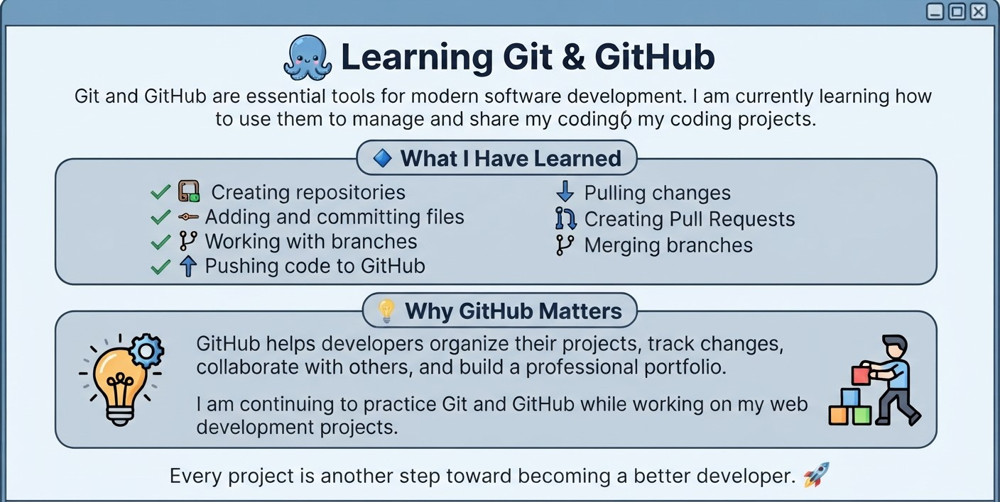

# 🐙 Learning Git & 

Git and GitHub are essential tools for modern software development. I am currently learning how to use them to manage and share my coding projects.

### 🔹 What I Have Learned

* Creating repositories
* Adding and committing files
* Working with branches
* Pushing code to GitHub
* Pulling changes
* Creating Pull Requests
* Merging branches

### 💡 Why GitHub Matters

GitHub helps developers organize their projects, track changes, collaborate with others, and build a professional portfolio.

I am continuing to practice Git and GitHub while working on my web development projects.

> Every project is another step toward becoming a better developer. 🚀

#GitHub #Git #WebDevelopment #Programming #SoftwareDevelopment #Learning
